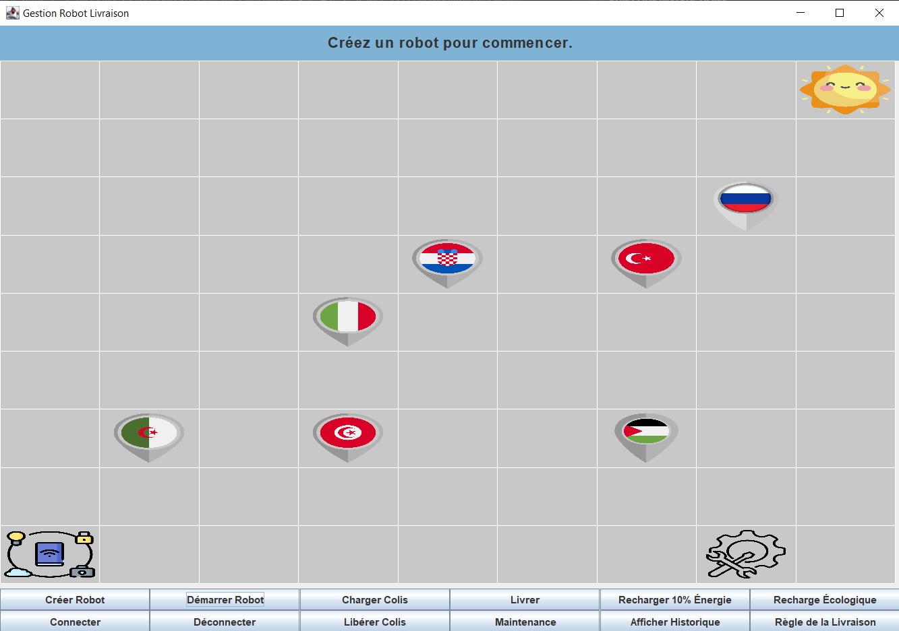
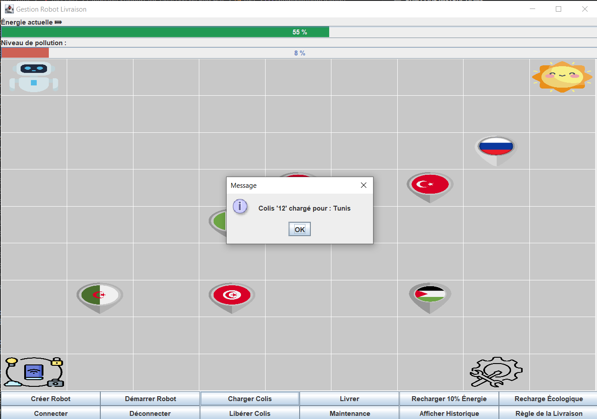
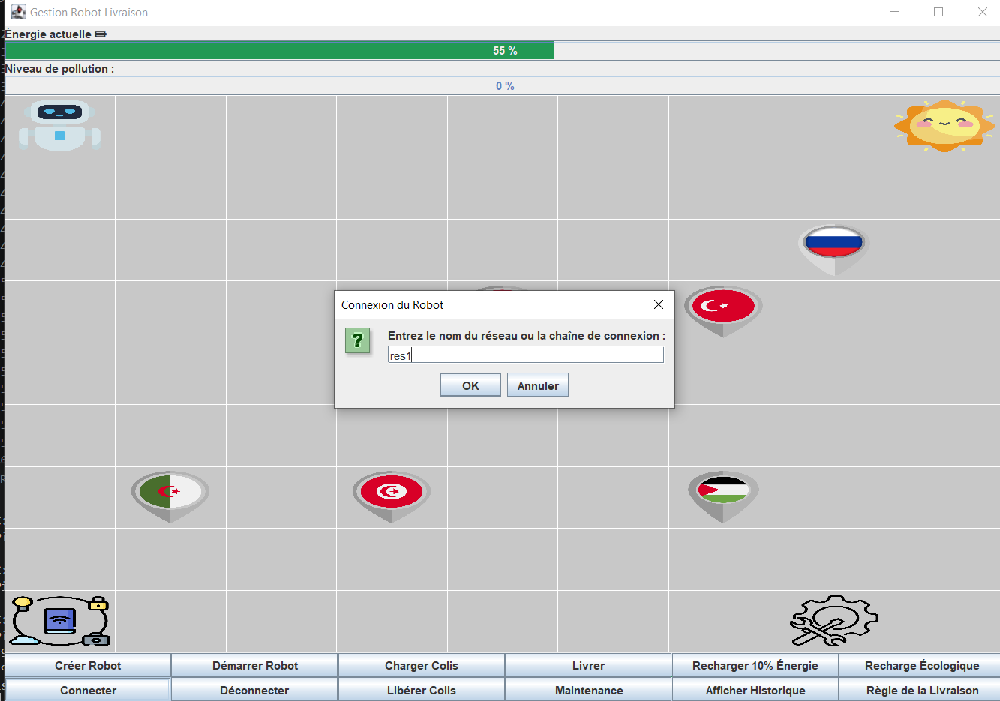
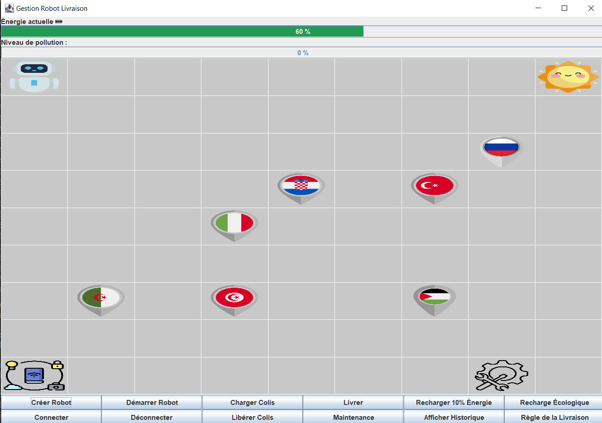
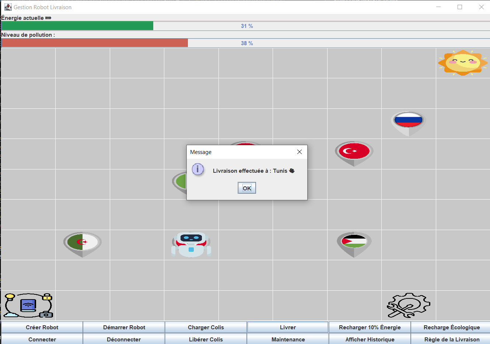

# 🤖 Gestion Robot Livraison

Application de bureau Java simulant la gestion d'un robot de livraison sur une carte
interactive, avec suivi en temps réel de l'énergie, de la pollution et de l'historique
des actions.

---

##  Table des matières

- [Aperçu](#-aperçu)
- [Architecture du projet](#-architecture-du-projet)
- [Fonctionnalités](#-fonctionnalités)
- [Règles métier](#-règles-métier)
- [Installation](#-installation)
- [Utilisation](#-utilisation)
- [Auteur](#-auteur)

---

## Aperçu

### Interface principale


### Création du robot & chargement d'un colis


### Connexion du robot au réseau


### Robot créé et prêt


### Livraison effectuée


---

## Architecture du projet
├── Robot.java                        # Classe de base du robot
├── RobotLivraison.java               # Robot spécialisé livraison
├── RobotConnecte.java                # Gestion de la connexion réseau
├── InterfaceRobot.java               # Interface commune aux robots
├── Connectable.java                  # Interface de connexion
├── MAP.java                          # Carte graphique (QGraphicsScene-like)
├── test.java                         # Main — IHM Swing
├── RobotException.java               # Exception générique robot
├── EnergieInsuffisanteException.java # Exception énergie insuffisante
├── MaintenanceRequiseException.java  # Exception maintenance requise
└── *.png                             # Assets graphiques (drapeaux, icônes)

---

## Fonctionnalités

| Action | Description |
|--------|-------------|
| **Créer Robot** | Initialise un robot avec un ID et une énergie de départ (0–100%) |
| **Démarrer Robot** | Met le robot en marche |
| **Charger Colis** | Associe un colis et une destination au robot |
| **Livrer** | Déplace le robot vers la destination, consomme énergie et génère pollution |
| **Recharger 10%** | Recharge classique : +10% énergie, **+20% pollution** |
| **Recharge Écologique** | Déplace vers le soleil ☀️ : +30% énergie, **−30% pollution** |
| **Connecter / Déconnecter** | Connexion réseau requise avant toute livraison |
| **Libérer Colis** | Libère le robot sans effectuer la livraison |
| **Maintenance** | Remet les heures d'utilisation à 0 (requise après 5h d'utilisation) |
| **Afficher Historique** | Journal complet des actions du robot |
| **Règle de la Livraison** | Affiche les règles et contraintes du système |

---

## Règles métier

### Énergie
- Le robot nécessite de l'énergie pour chaque déplacement (calculée selon la distance).
- En dessous du seuil minimum, toute action est bloquée.
- La recharge écologique nécessite au moins **10% d'énergie** pour atteindre le soleil.

### Pollution
- Augmente à chaque livraison (proportionnellement à la distance).
- Augmente de **+20%** à chaque recharge classique.
- Diminue de **−30%** lors d'une recharge écologique.
- Diminue automatiquement de **2% toutes les 3 secondes**.
- Au-delà de **90%**, le robot est **bloqué** jusqu'à redescendre sous ce seuil.

### Livraison
- Le robot doit être **démarré** et **connecté** avant de livrer.
- Un colis doit être chargé au préalable.

### Maintenance
- Requise lorsque les heures d'utilisation dépassent **5h**.
- Le robot se déplace vers le centre de maintenance pour effectuer l'opération.

---

## Destinations disponibles

| Destination | Position sur la carte |
|-------------|----------------------|
| Tunis 🇹🇳 | (6, 3) |
| Algérie 🇩🇿 | (6, 1) |
| Italie 🇮🇹 | (4, 3) |
| Croatie 🇭🇷 | (3, 4) |
| Turquie 🇹🇷 | (3, 6) |
| Palestine 🇵🇸 | (6, 6) |
| Russie 🇷🇺 | (2, 7) |
| Soleil ☀️ | Station de recharge écologique |

---

## Installation

### Prérequis
- Java JDK 11+
- Un IDE Java (VS Code, IntelliJ, Eclipse) ou compilation en ligne de commande

### Compilation & exécution

```bash
# Compiler tous les fichiers
javac *.java

# Lancer l'application
java test
```

---

## Utilisation

1. Cliquer sur **Créer Robot** → entrer un ID et une énergie initiale
2. Cliquer sur **Démarrer Robot**
3. Cliquer sur **Connecter** → entrer un nom de réseau
4. Cliquer sur **Charger Colis** → entrer un nom de colis et choisir la destination
5. Cliquer sur **Livrer** → le robot se déplace et effectue la livraison
6. Surveiller les barres **Énergie** et **Pollution** en haut de l'écran
7. Utiliser **Recharge Écologique** pour recharger proprement quand l'énergie le permet

---

## Auteur

**Mariem Elabed**  
INSAT — Diplôme National d'Ingénieur en Réseaux Informatiques et Télécommunications  
Année universitaire : 2025 – 2026
